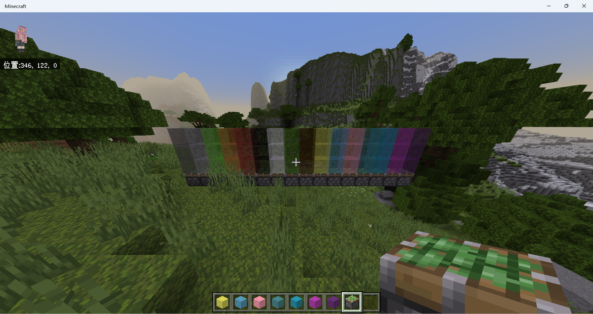

# ColoredSlimeBlock


This mod adds 16 different colored slime blocks to your PNX server!

Slime blocks of different colors will not stick to each other (see regular slime blocks and honey blocks)

This mod is a test of PNX's new piston API 

### How to make them?

Normal slime block + dye = colored slime block

### How to install?

1. Download the latest version of [PowerNukkitX](https://github/PowerNukkitX/PowerNukkitX)
2. Download the latest version of this mod
3. Put the ```jar``` file into ```plugins``` folder and the ```mcpack``` into ```resource_packs``` folder
4. Start the server. Enjoy ~ !